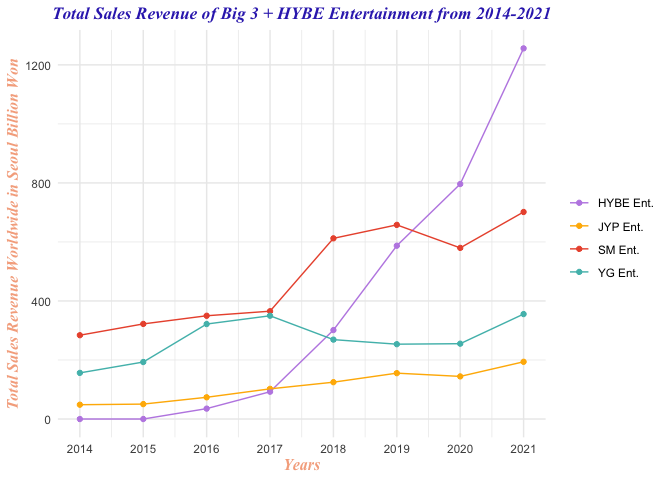
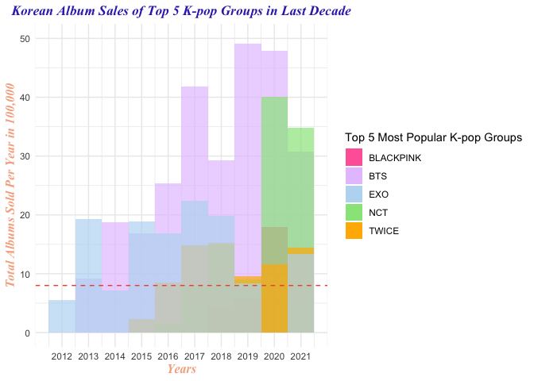
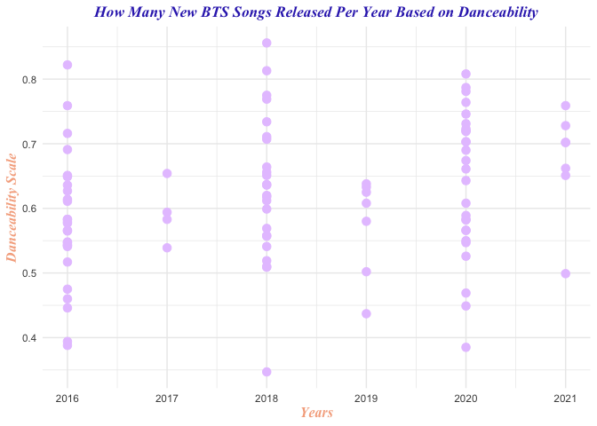
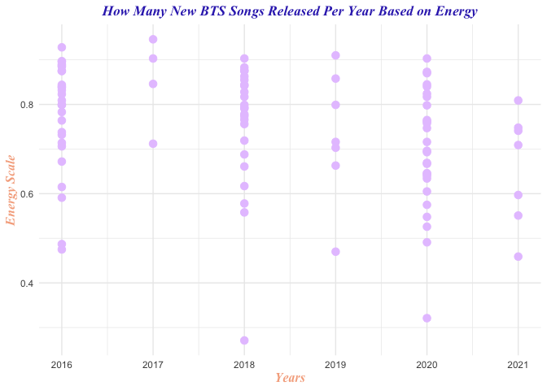
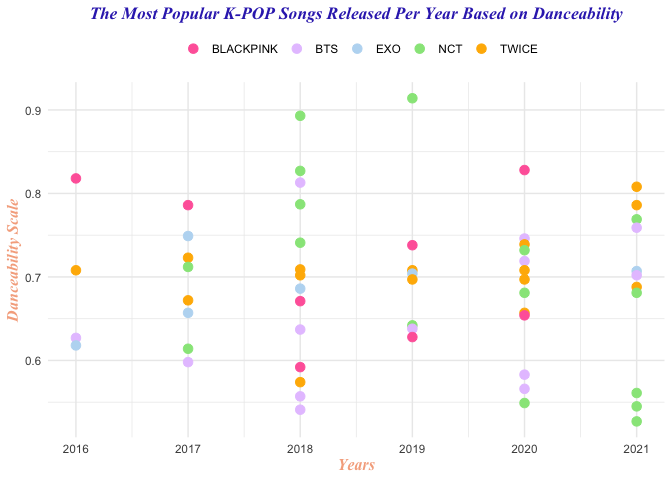
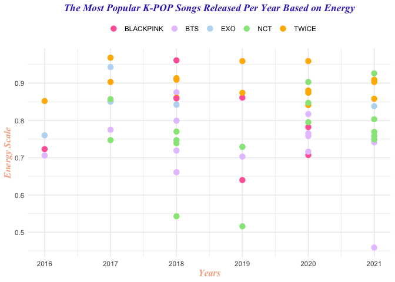

BTS: A Korean Boy Band for the People and the South Korean Economy too

**Introduction**

*Hallyu.* A singular word used to describe the immigration and diffusion
of Korean culture in Western societies that occurs through the growing
popularity of Korean video games, dramas and pop music in various social
and digital platforms (Jin, 2020). This cultural phenomenon, famously
known as the **Korean Wave**, originated in the late 1990s and early
2000s with its popularity limited to young adult and teenage fans in
Asian countries. However, Korean culture, entertainment and technology
entered headlines and Western media in the early 2010s with the help of
social media platforms like YouTube, Facebook and Twitter. The influx of
K-pop — a shortened term for the Korean pop music genre — is one of
Hallyu’s many yet successful carriers that has sparked interest in South
Korean culture as it ranked the seventh most popular type of music in
the world in 2019 (International Federation of the Phonographic
Industry, 2020). But among the vast genre stands Bangtan Sonyeondan
(BTS) — a seven male member group that has accumulated over 40 million
fans worldwide and a net worth of 100 million USD since their 2013 debut
in the Korean music industry (Dee, 2022). This paper will not only
discuss BTS’s monetary contributions to the South Korean economy but
also compare how their songs’ musical qualities like danceability and
energy differ with other K-pop artists.

**Discuss**

BTS consists of seven male members — Jin, RM, Suga, J-Hope, Jimin, V and
Jungkook — and are among the top 50 highest-paid celebrities in the
**world**, according to *Forbes’s* Celebrity 100 list in 2020
(Badenhausen et al., 2020). Standing at \#47 and an estimated earning of
50 million USD by June 2020, BTS is the only Korean artist overall to be
featured on the Celebrity 100 (J.K., 2020). Completing more than 150
tours and having 230+ songs in their discography, the seven member
Korean boy band reportedly generates about 3.54 billion USD as economic
value per year and 1.26 billion USD as added value per year noted in a
2018 Hyundai Research Institute report (Shadow, 2019). The Korean boy
band’s almost 5 billion USD contribution accounted for 0.3 percent of
South Korea’s 2018 GDP, rivaling Korean Air’s 11.65 billion USD and 0.7
percent (Buchholz, 2019).

However, BTS is only one of 13 artists managed under HYBE Entertainment
that include other rising K-pop boy bands like SEVENTEEN, TXT and
Enhypen. HYBE Entertainment is one of South Korea’s major music
companies that handles the inner workings of the K-pop industry, and was
formerly known as Big Hit Entertainment before it bought three other
entertainment agencies in 2019 and 2020. Talent agencies or
entertainment companies are no stranger to individuals aspiring to work
in Korean media as entertainment companies can manage musical artists,
actors and models. This is the case and the norm that was set by South
Korea’s three biggest and most successful entertainment companies aka
the “Big 3”. The “Big 3” consists of SM Entertainment, YG Entertainment
and JYP Entertainment that have not only financially handled hundreds of
artists but also paved the way for K-pop’s popularity from the early
‘90s to present day. Excluding BTS, the next four most popular K-pop
artists reside under at least one of the “Big 3” companies.

Rivaling against the most successful and biggest Korean entertainment
agencies is no small feat, but HYBE has managed to overtake the trio in
the last two years as seen in the graph below.

To create this graph, I first gathered each entertainment’s total
worldwide sales revenue from the designated time range, which was 2014
to 2021, into one dataset using Statista datasets. However, HYBE
Entertainment only had revenue data available from 2016 to 2021 and
therefore, I had to input NA = 0 for rows 2014 and 2015 — this is also
why HYBE’s 2014 and 2015 markers on the graph are at 0. The dataset only
has three columns: Korean Entertainment Company, Year and Total —
shortened from Total Sales Revenue — that represent the true numerical
values of each company’s total worldwide sales revenue in billion ₩. 100
₩ is equivalent to 79 cents or roughly $1 USD, so 100 billion ₩ equals
about 78 million USD. To put the data into context, HYBE Entertainment’s
total sales revenue recorded 35.22 billion ₩ (~28 million USD) in 2016
and ranked the lowest compared to the “Big 3”. SM Entertainment just
barely topped YG Entertainment with 349.87 billion ₩ (~276 million USD)
and 321.84 billion ₩ (~254 million USD) respectively in 2016. While SM
would continue to ride high as the top-selling entertainment company,
HYBE would completely surpass the “Big 3” in both 2020 and 2021. While
SM Entertainment, YG Entertainment and JYP Entertainment ranged revenue
sales between 200 billion ₩ and 700 billion ₩ in 2021, HYBE breached the
**trillions** with 125.593 trillion ₩ (99 billion USD). So why the
sudden influx and how did HYBE manage to blow past the “Big 3” in five
years?

As mentioned before, the top four K-pop male and female groups are
managed under the “Big 3” and hold the most popular K-pop groups of 2022
in addition to BTS’s \#1 spot. In order, the top five most popular K-pop
groups of 2022 ranking from \#1 to \#5 follows: BTS, EXO, TWICE,
BLACKPINK and NCT (Kanojia, 2021). Both EXO and NCT, which includes
subgroups known as NCT 127, NCT DREAM and NCT U, are signed under SM
Entertainment while JYP Entertainment manages TWICE and YG Entertainment
handles BLACKPICK. Even with major groups like EXO and NCT, SM
Entertainment was unable to overtake HYBE Entertainment in 2020 and 2021
in total worldwide sales revenue. Why? Well, let’s observe this graph
below:

To create this graph, I searched up each of the top 5 K-pop groups’
discographies and recorded the number of Korean copies sold for each
studio album, repackaged album and extended play album between 2012 and
2021 into a single dataset using Excel. I only included Korean copy
sales because those numbers were recorded by the Gaon Music Chart, which
is South Korea’s national music industry chart that ranks the
best-selling albums and most popular songs. I also excluded live
performance albums, Japanese albums and US sales data as not every
studio album, repackaged album or extended play album was sold outside
of South Korea. After that, I coded the dataset into histograms to show
how each groups’ album sales changed over the past decade. However, not
every group debuted or released albums since 2012 and were instead
replaced with NA values in the Album column and 0 in the Total Physical
Copies Sold column. For example, TWICE did not release any albums until
their debut in 2015, so no data was counted between 2012 and 2015. A
mean of the Total Physical Copies Sold is calculated to be 8.006499 as
in 800,649.9 physical albums on average have been sold among the five
groups in the past decade.

    ## [1] 8.006499

From the graph, most if not all of the five groups sold above the
average Total Physical Copies Sold every year between 2013 and 2021. EXO
and BTS are the most vibrant and varied in album sales from their debut
years in 2012 and 2013 respectively to the late 2010s. However, BTS
again surpassed the other four groups between 2016 and 2020 with album
sales of ~2.6 million Korean copies in 2016 and ~8.6 million copies in
2020. To put into perspective as to how much album sales can affect a
company’s sales revenue, HYBE Entertainment recorded 376.88 billion ₩
(~299 million USD) worth of album sales in 2021, which accounted for
roughly 30 percent of the company’s total sales revenue mentioned
earlier (Statista, 2021). Despite suffering a drop in 2021, BTS’s album
sales show an increasing trend from their start in 2013 before rivaling
world-renowned groups like EXO in 2016. But why 2016 and what makes
BTS’s music so different from other K-pop groups that their album sales
skyrocket? Well, let’s take a look at their musicality:

**Compare**

Below are two graphs showcasing BTS songs released between 2016 and 2021
based on a specific audio feature: danceability and energy. Each dot
represents one song released during its designated year and could be
from a studio album, extended play album or a single along with its
matching danceability or energy measurement. Creating data
visualizations for audio features like danceability and energy are
common as they can visually represent how likable a song is, and
potentially show trends between certain artists and the type of music
they make. Danceability is measured by ranking how suitable a track is
based on musical elements like tempo, rhythm stability and beat strength
on a scale from 0 to 1.0 (Ashrith, 2019). While energy measures
intensity and activity on the same scale from 0 to 1.0, so songs that
have high energy are usually fast and noisy (Ashrith, 2019).

To clean these graphs, I took out the audio features I wasn’t measuring
like tempo, valence and duration per ms. I also removed any Western
artists that BTS collaborated with because I wanted to solely compare
BTS tracks with other K-pop artists. I didn’t combine the BTS dataset
with the other dataset because not every song that BTS released between
2016 and 2021 was a popular hit due to many of them being B-side tracks.
Since I couldn’t differentiate which plot points would be a popular hit
or a regular B-side track for BTS when I first tried to join both
datasets, I ultimately went with creating separate graphs for each
datasets.

According to these graphs, it appears that most new BTS songs released
during 2016, 2018 and 2020 were more energetic and had higher
danceabilities compared to songs released 2017, 2019 and 2021. This
makes sense because energetic tracks will usually invoke danceability,
which line up with the album concepts BTS were releasing those years.
2016 marked BTS’s rise to global stardom as their second studio album
Wings sold ~1.5 million Korean copies and featured “Blood, Sweat &
Tears”, which broke several records within 24 hours of its music video’s
release. The music video became the most viewed K-pop video in 24 hours
with 6.34 million views and the fastest video to hit 10 million views in
41 hours (J.K, 2016). Yet, an interesting observation to note is how the
Korean boy band only released four new songs in 2017 and still topped
album sales in 2017 despite most of their albums having the same songs.
Even then, those four songs ranked high on the energy scale as does most
of BTS’s discography. A reason for their popularity can be attributed to
their tendency to release high energy and dance-heavy tracks, which
depends on their album concepts. However, if other K-pop artists who may
not release an album that matches its concept with high energy and
dance-heavy tracks at the same time that BTS does, then it’s hard to
beat based on the previously mentioned album sales graph.

For the two graphs above, they represent the most popular hits per year
released between 2016 and 2021 by the top five most popular K-pop groups
also based on specific audio features: danceability and energy. The same
reference from the previous graphs apply to the above graphs as each dot
represents one song released during its designated year and could be
from a studio album, extended play album or a single along with its
matching danceability or energy measurement.

To clean these graphs, I also took out the audio features I wasn’t
measuring like tempo, valence and duration per ms from each dataset that
were originally separated by year. After cleaning out the rows I didn’t
want from each of the six datasets, I merged them all into one dataset
and ran into a familiar problem. As mentioned before, NCT has multiple
sub-groups known as NCT U, NCT DREAM and NCT 127. I had to make the
program recognize that any time it saw those three terms that it could
be simply labeled as NCT, so it would be easier to call back that
specific object in the code. Again, I included BTS in these graphs
because not every song that they released between 2016 and 2021 became a
popular hit for those same years. Furthermore, it is also now possible
to count how many of their songs actually were popular per year from the
total amount that was shown with previous graphs.

**Conclusion**

Through this paper, an analysis of BTS and four K-pop groups —
BLACKPINK, EXO, NCT, TWICE — was conducted to observe how K-pop’s
monetary value can be translated from artists’ discographies and to
locate the exact time spot that BTS began its global domination
musically and financially. While the K-pop industry may seem like a
simple music industry, it is much more. It’s business, fashion, social
media and much more as idol-life is seen more as a gateway to other
routes of success like modeling and acting in South Korea. BTS has not
only made their mark on the world with their music but their financial
contributions from their musical careers has managed to affect its own
nation’s GDP — sparking both amazement and concerns from fans across the
globe.

***References***

Ashrith. (2019, March 22). What Makes A Song Likeable? Medium.
<a href="https://towardsdatascience.com/what-makes-a-song-likeable-dbfdb7abe404" class="uri">https://towardsdatascience.com/what-makes-a-song-likeable-dbfdb7abe404</a>

Badenhausen, K., Becoats, K., Berg, M., Chmielewski, D., Cuccinello, H.,
Freeman, A., Settimi, C., Shapiro, A., & Sorvino, C. (2020, August 31).
The Celebrity 100: The World’s Highest-Paid Celebrities 2020. Forbes.
<a href="https://www.forbes.com/celebrities/" class="uri">https://www.forbes.com/celebrities/</a>

Buchholz, K. (2019, November 5). Infographic: How Much Money Does BTS
Make for South Korea? Statista Infographics; Statista.
<a href="https://www.statista.com/chart/19854/companies-bts-share-of-south-korea-gdp/" class="uri">https://www.statista.com/chart/19854/companies-bts-share-of-south-korea-gdp/</a>

Dee, E. (2022, April 5). BTS Net Worth 2022: The Boy Band That Smashed
All Sorts of Records Earns How Much?! Music Times.
<a href="https://www.musictimes.com/articles/84413/20220405/bts-net-worth-2022-boy-band-smashed-sorts-records-earns.htm" class="uri">https://www.musictimes.com/articles/84413/20220405/bts-net-worth-2022-boy-band-smashed-sorts-records-earns.htm</a>

International Federation of the Phonographic Industry. (2020). Music
Listening 2019. (p. 8). International Federation of the Phonographic
Industry.
<a href="https://www.ifpi.org/wp-content/uploads/2020/07/Music-Listening-2019-1.pdf" class="uri">https://www.ifpi.org/wp-content/uploads/2020/07/Music-Listening-2019-1.pdf</a>

J.K. (2016, October 23). BTS’s “Blood Sweat & Tears” MV Breaks Another
Record As Views Continue To Soar. Soompi.
<a href="https://www.soompi.com/article/909239wpp/bts-blood-sweat-tears-mv-breaks-another-record-views-continue-soar" class="uri">https://www.soompi.com/article/909239wpp/bts-blood-sweat-tears-mv-breaks-another-record-views-continue-soar</a>

J.K. (2020, June 4). BTS Lands Spot In Top 50 Of Forbes’s 2020 List Of
The World’s Highest-Paid Celebrities. Soompi.
<a href="https://www.soompi.com/article/1404789wpp/bts-lands-spot-in-top-50-of-forbess-2020-list-of-the-worlds-highest-paid-celebrities" class="uri">https://www.soompi.com/article/1404789wpp/bts-lands-spot-in-top-50-of-forbess-2020-list-of-the-worlds-highest-paid-celebrities</a>

Jin, D. Y. (2020, May 26). The Korean Wave. Georgetown Journal of
International Affairs.
<a href="https://gjia.georgetown.edu/2020/05/26/the-korean-wave/" class="uri">https://gjia.georgetown.edu/2020/05/26/the-korean-wave/</a>

Kanojia, A. (2021, June 9). Top 20 Most Popular K-POP Groups in the
World 2022. PopMellow.
<a href="https://popmellow.com/top-k-pop-groups/" class="uri">https://popmellow.com/top-k-pop-groups/</a>

Shadow, W. (2019, November 7). The “BTS Effect” on South Korea’s
Economy, Industry and Culture. Medium.
<a href="https://shadow-twts.medium.com/the-bts-effect-on-south-koreas-economy-industry-and-culture-975e8933da56" class="uri">https://shadow-twts.medium.com/the-bts-effect-on-south-koreas-economy-industry-and-culture-975e8933da56</a>

Statista. (2021, March). HYBE: sales revenue by category 2021. Statista;
HYBE Annual Report 2021 (DART), page 20.
<a href="https://www.statista.com/statistics/917073/south-korea-bighit-entertainment-sales-value-by-category/" class="uri">https://www.statista.com/statistics/917073/south-korea-bighit-entertainment-sales-value-by-category/</a>
